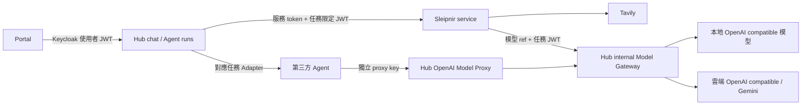

# Agent 整合實作與啟用

## 現在的分工

Hub 負責 Agent 目錄、啟用狀態、容器生命週期、使用者授權、任務狀態與模型路由。Sleipnir 保持獨立專案，負責搜尋策略、Tavily 與工具迴圈。Portal 負責選擇模型、Agent、呈現進度、來源及取消。



模型能力由 Hub 的 ModelResolver 統一判定。原生 Agent 不自行偵測供應商；支援工具呼叫的模型走 tool_calling，否則走 search_first。能力來自模型目錄／雲端連線設定，不會自動呼叫付費模型探測。

第三方 Agent 的「模型 endpoint」與「任務 API endpoint」是兩回事。只有模型 endpoint/API key 設定介面，足以讓它使用 Hub 模型代理，但不足以让 Hub 遠端提交或取消任務。模型代理不會自動改寫第三方程式。

## 檔案結構與功能

以下省略空的 __init__.py。每個新增的功能檔案用途列在同一行。

```text
Four_season_hub/
├─ resources/agents/
│  └─ agents.json                         # Agent 定義；初始 disabled，重啟載入
├─ app/infrastructure/
│  ├─ config/settings.py                  # Hub Agent secrets 與設定
│  └─ streaming/sse.py                    # SSE 完整 frame 解析與輸出
├─ app/modules/agent_management/
│  ├─ domain/agent_definition.py          # 整合、runtime、model binding、能力契約
│  ├─ domain/enums.py                     # 三種整合與四種模型綁定
│  ├─ repositories/agent_catalog.py       # 目錄 repository 介面
│  ├─ repositories/json_agent_catalog.py  # JSON 載入、驗證、獨立副本
│  ├─ services/agent_registry_service.py   # Mongo 啟用狀態覆寫目錄預設
│  ├─ services/agent_lifecycle_service.py  # readiness、受管 Docker 啟停與 drain
│  ├─ exceptions.py                       # 明確的目錄／狀態錯誤
│  ├─ bootstrap.py                        # 組裝 registry、runs、gateway、executors
│  └─ router.py                           # Agent 列表、管理、run 狀態、取消、proxy keys
├─ app/modules/agent_execution/
│  ├─ ports/agent_executor.py             # Executor 介面
│  ├─ schemas/execution_request.py        # 原生服務 run request 與限制
│  ├─ schemas/execution_events.py         # 有順序的來源、進度、文字、terminal events
│  ├─ schemas/cancellation_response.py    # 取消請求與已停止確認分開
│  ├─ schemas/task_request.py             # Hub 内部任務；可無 model_ref
│  ├─ schemas/web_search_options.py       # 搜尋 options 白名單與範圍
│  ├─ repositories/agent_run_repository.py# Mongo ownership、取消旗標、terminal state
│  ├─ services/task_policy.py             # 綁定模式、參數、options 驗證
│  ├─ services/agent_run_service.py        # prepare、timeout、取消監看、執行狀態
│  └─ infrastructure/
│     ├─ remote_agent_client.py           # 原生 HTTP/SSE executor，驗證 run 與事件
│     └─ openai_chat_agent.py             # 第三方 OpenAI chat 任務 adapter
├─ app/modules/model_gateway/
│  ├─ domain/model_target.py              # 解析後的供應商 endpoint 與能力
│  ├─ schemas/completion_request.py       # 模型消息、工具、provider state reference
│  ├─ schemas/completion_response.py      # 統一回應與 token usage
│  ├─ schemas/completion_event.py         # 模型串流事件
│  ├─ services/model_resolver.py          # 本地／雲端模型解析
│  ├─ services/model_gateway_service.py   # 能力與歷史驗證、供應商 dispatch
│  ├─ providers/openai_compatible.py      # OpenAI-compatible complete／stream
│  ├─ providers/gemini.py                 # Gemini REST、thought signature 保留
│  ├─ security/access_key_service.py      # run JWT 與雜湊儲存的 proxy keys
│  ├─ compatibility/openai_router.py      # 第三方標準 chat/completions + models
│  ├─ exceptions.py                       # 模型解析錯誤
│  └─ router.py                           # 原生 Agent 使用的 internal API
├─ app/modules/chat/                      # 對話分派、模型／Agent 綁定與來源保存
├─ app/modules/cloud_llm_management/      # 修復 domain／repository，新增更新 API
├─ docs/contracts/                        # 既有 v1 契約
├─ .env.agent.example                     # 新增 Hub 設定樣板，無真實金鑰
└─ tests/
   ├─ test_agent_integration.py            # 授權、策略、SSE、供應商與生命週期邊界
   └─ test_web_search_service.py           # 兩種搜尋模式、來源、取消與 SDK 工具歷史

Sleipnir/
├─ src/sleipnir_agent/
│  ├─ async_agent.py                      # 保留所有 tool calls 與 provider state
│  └─ __init__.py                         # Gemini client 延遲載入
└─ services/web_search/
   ├─ pyproject.toml                      # 獨立 service 套件，引用本地 SDK
   ├─ Dockerfile                          # 從 Sleipnir root 建置；單 worker
   ├─ .env.example                        # Tavily、服務 token、Hub 回呼 URL
   ├─ README.md                           # 服務啟動指南
   └─ src/web_search_service/
      ├─ main.py                          # readiness、run SSE、取消與 bounded run storage
      ├─ settings.py                      # service settings
      ├─ streaming.py                     # 模型 SSE 解析
      ├─ contracts/execution_request.py   # v1 契約副本，不 import Hub
      ├─ contracts/execution_events.py    # v1 事件副本；測試檢查一致
      ├─ clients/hub_model_client.py      # 任務限定 gateway client 與 usage 累計
      ├─ tools/tracked_search_backend.py  # 搜尋次數、結果長度與來源彙整
      └─ services/execution_service.py    # tool_calling／search_first 策略

Four-seasons-hub-portal/src/
├─ types/chat.types.ts                    # modelRef、Agent、來源與事件型別
├─ core/api/modules/chat.api.ts           # 帶使用者 JWT 的 chat／Agent API
└─ features/chat/
   ├─ streaming.ts                        # UTF-8、跨 chunk 與 multiline SSE
   └─ ChatPage.tsx                        # 模型／Agent 選擇、進度、來源、停止
```

閱讀順序：agent_definition → task_policy → agent_run_service → remote_agent_client → Sleipnir execution_service → HubModelClient → ModelResolver／ModelGatewayService → ChatStreamService → ChatPage。

## 本地啟用 Sleipnir

1. 將 .env.agent.example 的必要設定合併至 Hub 的現有 .env。產生兩個不同的隨機 secrets：APP_AGENT_SIGNING_KEY 至少 32 字元；APP_AGENT_SERVICE_TOKEN 是 Hub 呼叫服務的 token。實際 .env 未由這次整合修改。
2. 在 Sleipnir/services/web_search 建立 .env，依 .env.example 填入 APP_TAVILY_API_KEY、與 Hub 相同的 APP_SERVICE_TOKEN，以及 APP_HUB_GATEWAY_URL。
3. 本機 Hub 假設在 8080：gateway URL 為 http://127.0.0.1:8080/internal/v1/model。若原服務使用別的 port，請改為實際位址。
4. 將 Hub resources/agents/agents.json 的 web-search integration.endpoint 設為 http://127.0.0.1:8101，runtime 保持 external。目錄是啟動快照，改完需重啟 Hub。
5. 在 Sleipnir/services/web_search 執行：
   ```powershell
   uv sync
   uv run uvicorn web_search_service.main:app --host 127.0.0.1 --port 8101 --workers 1
   ```
6. 啟動既有 Hub、Mongo、Postgres、Keycloak 及 Portal；用 admin 身分呼叫 PATCH /v1/admin/agents/web-search，body 為 {"enabled":true}。啟用檢查服務契約、版本與 Hub secrets；readiness 不會驗證 Tavily 帳號額度或模型付費呼叫。
7. Portal「建立新對話」，選擇已 ready 本地模型或已 enabled 的雲端連線，再選 Sleipnir Web Search。

本地模型目錄需標示 streaming:true；toolCalling 只有實際支援並配置工具 parser 的模型才設 true。未知時 false，走 search_first。雲端連線由 admin 設定 provider、model、base_url、加密 API key、streaming／toolCalling，並使用現有雲端管理或 PATCH 啟用。OpenAI-compatible base_url 包含 /v1；Gemini base_url 包含 /v1beta。

## Docker 生命週期

從 Sleipnir 根目錄建置：
```powershell
docker build -f services/web_search/Dockerfile -t sleipnir-web-search:0.1.0 .
```

將 Agent runtime 改為 {"type":"docker","image":"sleipnir-web-search:0.1.0"}。Hub 使用既有 APP_CONTAINER_NETWORK_NAME 的 Docker network；需事先建立。啟動 API 為 POST /v1/admin/agents/web-search/start，停止 API 為 POST /v1/admin/agents/web-search/stop。

Hub 管理的容器名稱是 fsh-agent-web-search，沒有發布 host port。Hub 需在同一 network，integration.endpoint 使用 http://fsh-agent-web-search:8101；Hub 若在 Windows host，請自行啟動有 port mapping 的 external 容器，而非使用此 managed Docker 模式。

APP_AGENT_RUNTIME_ENVIRONMENT 是 JSON，按 agent id 提供 env，例如：
```json
{"web-search":{"APP_TAVILY_API_KEY":"填入服務金鑰","APP_HUB_GATEWAY_URL":"http://hub:8080/internal/v1/model"}}
```
Hub 自動加入 APP_SERVICE_TOKEN。容器到 Hub 的 URL 要從容器內可連線；Hub 在 host 時可用 host.docker.internal，且需監聽可達介面。runtime env 與 secrets 變更不會重建既有容器，需由管理者更換容器。

external 服務由外部程序／部署工具管理；Hub 可啟停接收任務，但不會殺外部程序。Docker stop 先停用新任務，再等待既有任務結束；有 active runs 時拒絕停機。沒有映像建置、版本滾動升級、volume／GPU／Podman 管理。

## 第三方 Agent 的接法

若第三方接受 OpenAI-compatible base URL／API key：

1. admin POST /v1/admin/model-proxy/keys：
   ```json
   {
     "name":"third-party-instance",
     "models":{"hub-model":{"source":"local","id":"實際模型名稱"}},
     "expires_in_days":30,
     "requests_per_minute":30
   }
   ```
2. 回應 api_key 僅顯示一次。將第三方 base URL 設為 http://可達的Hub:8080/model-api/v1，API key 用該 key，model 設 hub-model。可將 alias 綁定雲端 connection id。
3. GET /v1/admin/model-proxy/keys 列出 keys；DELETE /v1/admin/model-proxy/keys/{key_id} 撤銷。代理支援 GET /models、POST /chat/completions，模型受 key 白名單與每分鐘速率限制。
4. 需要 Hub 提交任務時，另外確認第三方任務 API。符合非串流 OpenAI chat 任務 API 的可使用 adapter_id:openai_chat；其他協議需新增對應 Executor。
5. 任務認證放 APP_AGENT_CREDENTIALS JSON，例如 {"third-party-task":"任務 API token"}，Agent definition 的 credential_ref 引用 third-party-task。這與第三方呼叫 Hub 模型時使用的 proxy key 不同。

openai_chat 的 integration.endpoint 是完整任務路徑（如 http://agent:9000/v1/chat/completions），model_alias 是其「Agent 任務模型」名稱。model_binding 用 hub_fixed 或 agent_managed；Hub 不替其注入設定。此 adapter 將完整回答轉成 Hub 事件，文字是緩衝回傳，cancellation、status_query、structured_sources 均保持 false。mixed 在目前 adapter 也不支援每次任務切換模型。registration_only 只能登記，不能聊天。

例如 RAG Agent 若符合原生 v1，可部署獨立服务並直接新增目錄定義；若有自訂 options，需在 TaskPolicy 註冊 options schema。使用非 v1 任務 API 才新增 Executor 並在 bootstrap 注册。Hermes／OpenClaw 的實際版本與任務 API 未做驗證，不能只填 endpoint 就宣稱完整整合。

## API 與狀態

| API | 用途／授權 |
|---|---|
| GET /v1/agents | 使用者查看公開能力，不公開 secrets／內部 endpoint |
| GET /v1/admin/agents/{id}/health | admin readiness |
| PATCH /v1/admin/agents/{id} | admin 啟用／停用；Mongo 保存覆寫 |
| POST /v1/admin/agents/{id}/start、stop | admin 受管 Docker 生命週期 |
| POST /v1/chat/stream | 使用者 chat；ACK 包含 run_id |
| GET /v1/agent-runs/{run_id} | 僅擁有者查任務 |
| POST /v1/agent-runs/{run_id}/cancel | 僅擁有者請求取消 |
| POST /internal/v1/model/completions、completions/stream | 任務限定 JWT |
| /model-api/v1/models、chat/completions | 獨立模型 proxy key |

Chat body 新增 modelRef:{"source":"local或cloud","id":"識別字"}、agentId:"web-search"、agentOptions。AgentOptions 支援 max_iterations、max_search_calls、max_results_per_search。既有 model 字串仍代表本地模型。同一 conversation 固定 model 與 agent，需建立新對話才切換。

Mongo 新增 agent_settings、agent_runs、model_proxy_keys、model_proxy_rates、model_provider_states 與索引，無需新增 Postgres schema。來源、run_id、Agent 版本存於 assistant message；舊對話缺欄位時使用預設值。移除 DEV_USER，使用真實 Keycloak subject 隔離歷史與取消權限。

cancel_requested 表示已提出；前端收到 cancelled 事件才顯示停止確認。斷線或跨服務 timeout 只能記錄遠端狀態 unconfirmed；第三方不支援取消時，停止觀看可能仍有遠端工作。Hub 重啟不恢復執行，過期 run 在啟動／drain 時標為 timed_out。

## 目前邊界與驗證

- Sleipnir 服務 run map 在單一 process 記憶體中，必须 --workers 1；不支援多 replica 任意路由或重啟恢復。Hub run／取消旗標存 Mongo，可跨 Hub worker。
- 原生 Agent 與雲端 gateway v1 接受文字。既有一般本地聊天保留目前訊息的多模態路徑；歷史使用文字。
- 原生 Gemini 工具狀態按 run／模型／消息 fingerprint 儲存，保留 thought signatures。標準代理不傳遞此擴充狀態，故明確拒絕 Gemini 工具歷史／工具要求；純文字可用。
- 第三方 proxy 的工具串流會先完成工具決策再輸出標準 chunks；不是即時工具参数串流。未支援 Responses、Anthropic、圖片或完整 OpenAI SDK 全部參數。
- readiness 是配置／契約檢查，雲端 enabled 不是即時可用保證。未實際呼叫 Tavily 或雲端付費模型，未啟動或建置 Docker 容器。

Hub 根目錄：
```powershell
.\.venv\Scripts\python.exe -B -m unittest discover -s tests -v
```
測試使用假 HTTP／搜尋 backend；包括 search_first、tool_calling、來源、取消、重複 run、事件契約、工具配對、Gemini state、run token、model allowlist、provider 串流及 cloud mapper。需要相鄰的 Sleipnir repo。

Portal 根目錄：
```powershell
npm run build
npm run test:stream
```

## Agent 管理頁

Portal 的 Agent 管理頁現在呼叫 GET /v1/agents，顯示所有目錄條目，包括停用與僅登記 Agent。admin 可在頁面啟用／停用、健康檢查；Docker runtime 額外提供啟動與停用並停止容器。external runtime 仍在 IDE／部署系統啟動。新增定義使用 Hub 目錄，頁面不提供不存在的建立 API。API 載入失敗會顯示錯誤，不再當成空列表。


## 雲端連線測試與啟用

Gemini 的 Endpoint 可留空，模型推論與連線測試共用官方預設 https://generativelanguage.googleapis.com/v1beta。前端模型管理的雲端列表提供「測試連線」及「啟用／停用」。

POST /v1/admin/llm-connections/{id}/test 使用 admin 授權。Gemini 查詢 models.get；OpenAI-compatible 查詢 models 並確認配置的 model id。測試只驗證認證與模型資訊，不生成回答、不判定生成額度或自動探測工具能力，不會自動啟用連線。測試時間、延遲及結果寫入既有 Postgres 欄位；啟用狀態另行顯示。

GET /v1/admin/llm-connections/{id} 提供 admin 詳細資料；建立 API 回傳完整已建立的安全連線資料。前端 payload 避免同時送出 camelCase 與 snake_case 的重複欄位。連線測試成功後，按「啟用」，再於對話工作台重新載入模型選單並建立新對話測試回答。

測試與推論的共用端點位於 app/modules/cloud_llm_management/domain/endpoints.py；連線探測位於 services/connection_probe.py。tests/test_cloud_connection_probe.py 覆蓋 Gemini 空端點、認證／速率／模型錯誤與保存測試結果而不自動啟用。新增連線測試 API 後需重啟 Hub。


## 版面、Agent 同步與模型刪除

對話工作階段顯示模型名稱，長標題／文字／來源 URL 可換行；主區塊及 composer 限制在父容器寬度。Agent 管理將「程序啟停」與「接收新任務」分開：IDE 的 external 程序由 IDE 管理，前端仍可允許／停用新任務。服務 readiness 與任務 enabled 獨立顯示；启动程序不會自動覆寫 persisted enabled。

前端 catalog-sync 發布不含秘密的頁面事件與 localStorage revision；聊天頁在目錄變更、重新取得視窗焦點或手動更新時重新讀取 Hub。停用 Agent 仍顯示於選單，禁止新提交；既有對話保持原綁定。其他使用者在別台電腦操作時，不會即時推播，需切回視窗或手動更新。

雲端 DELETE /v1/admin/llm-connections/{id} 限 admin，移除 Postgres 連線及同列加密金鑰。前端「刪除連線」先确认，既有歷史保留；使用该連線的後續模型呼叫將失敗。

本地 DELETE /v1/mgt/models/registration/{model_name} 限 admin，僅移除模型目錄登記、保留模型檔案。需先停止 instance。JSON 目錄使用暫存檔與 atomic replace，保留其他條目；當前 process registry 同步移除。此既有本地模型管理基於 process 記憶體，若多 Hub process 共用目錄，其他 process 須重啟載入變更，不支援分散式刪除交易。要重新加入已移除的本地模型，需重新在模型目錄登記並重啟。

Sleipnir 的核心仍是 SDK；service 是外層 HTTP adapter，提供獨立依賴、部署與生命週期。直接 SDK 嵌入可省下服務程序與 HTTP，但 Agent 升級、錯誤、資源及執行取消會與 Hub process 耦合。此專案採 service 外層是為了支援獨立 Agent／第三方 Agent，而非將 SDK 替換掉。
